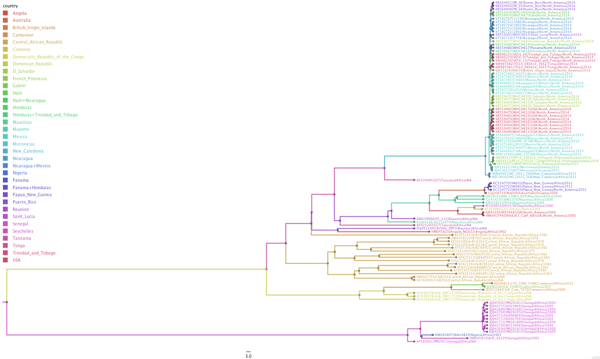
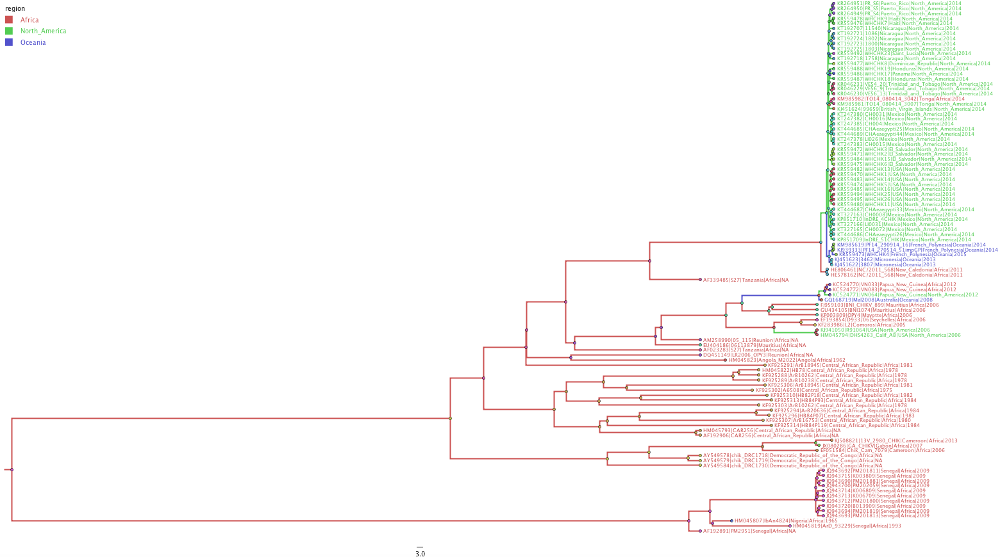

# Chikungunya Project

####Natalie Boesen1,2, Sidney Bell1,3, Trevor Bedford1

1Vaccine and Infectious Disease Division, Fred Hutchinson Cancer Research Center, Seattle, WA, USA, 2Redmond High School, Redmond, WA, USA, 3Molecular and Cellular Biology Graduate Program, University of Washington, Seattle, WA, USA

## Intro:
  My project is to research and document the dynamics of CHIKV during my internship at the Fred Hutchinson Cancer Research Center as part of the Bedford Lab. Currently, there is an outbreak of Chikungunya in the Caribbean. I wanted to know how the virus got there if its origin was in Africa. 
  
## Regions of Interest:
  1. North America 
  2. Africa
  3. Oceania 

## Research Questions:
  1. Were the current CHIKV outbreaks in Southeast Asia and in North America new introductions from Southern Africa, or
  endemic in Southeast Asia and North America from the original introduction?
  
    Hypothesis: Based on the family tree of 114 samples made in FigTree below, Chikungunya's current outbreaks in Oceania and North America spread from a re-emergence of Chikungunya in Tanzania that spread into Oceania then to Mexico, which created the gateway for CHIKV to enter the Caribbean.

    
  

  2. How are different strains of Chikungunya intermingling with other regions? What might cause that behavior?
    
    Hypothesis: Perhaps there is a correlation between the migration patterns of the Aedes Aegypti mosquitoes and the 
    migration patterns of people modern-day. There is a definite pattern in the old-world vs new-world versions of Chikungunya, in
    which its origins are from Northern Africa and it spreads southeast into Oceania, however the new-world version has expanded
    its previous range into Central America. This might be due to the propagation of Aedes Aegypti mosquitoes in warmer areas as a result of global warming, but the dramatic distance needed to travel across different regions is surely not possible by only mosquitoes due to their short flight range. This is where the role of humans comes into play. Maybe people traveling to the Caribbean for vacation carry the virus with them back home and the thermal scanners in airports did not detect CHIKV when tourists returned. Alternatively, people could spread the virus by means of international trade.
 

	

	  <iframe class="embed-responsive-item" src="http://www.youtube.com/embed/zLyMwWE-f8o"></iframe>
	

