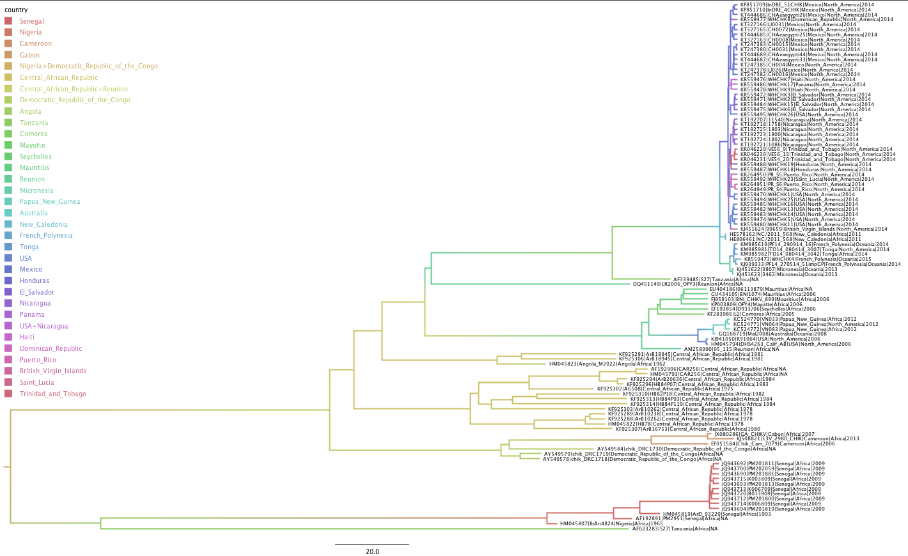
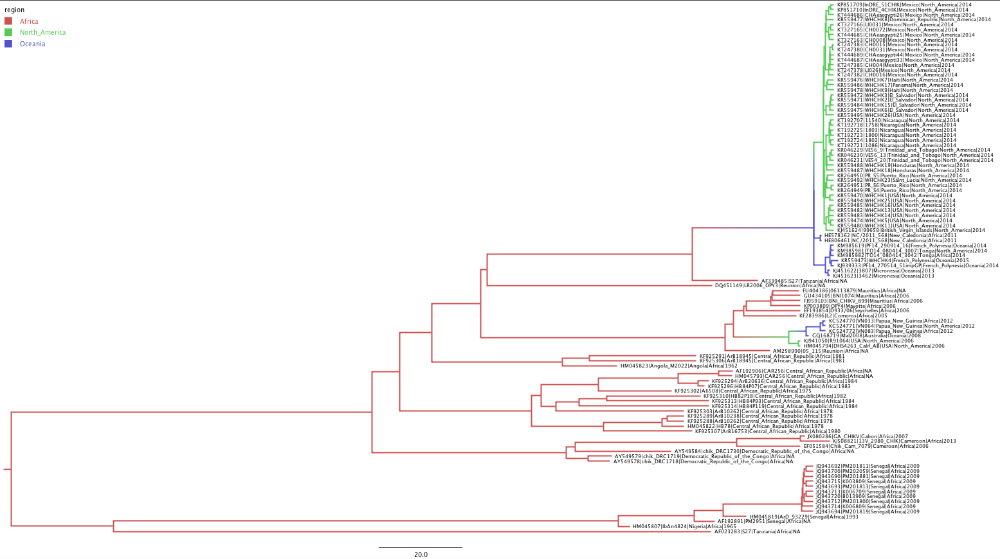
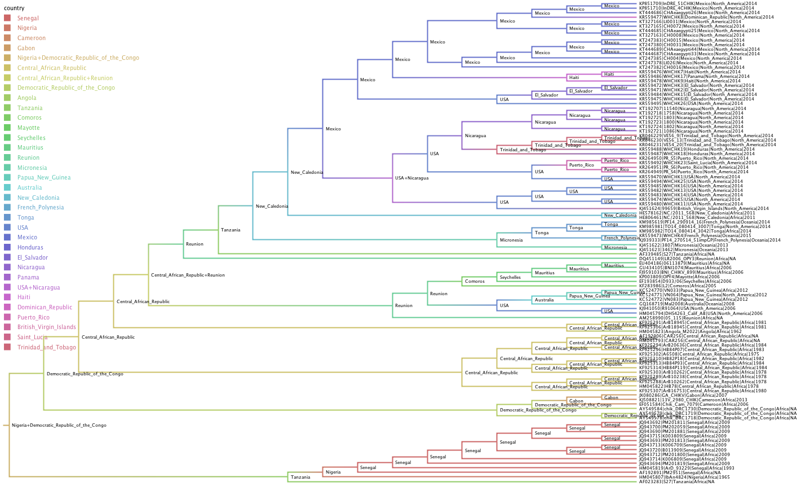

# Evolutionary and Phylogenetic Analysis of Chikungunya amongst Africa, Oceania, and North America

####Natalie Boesen1,2, Sidney Bell1,3, Trevor Bedford1

1Vaccine and Infectious Disease Division, Fred Hutchinson Cancer Research Center, Seattle, WA, USA, 2Redmond High School, Redmond, WA, USA, 3Molecular and Cellular Biology Graduate Program, University of Washington, Seattle, WA, USA

## Intro:
  My project is to research and document the dynamics of CHIKV during my internship at the Fred Hutchinson Cancer Research Center as part of the Bedford Lab. Currently, there is an outbreak of Chikungunya in the Caribbean. I wanted to know how the virus got there if its origin was in Africa. 
  
## Regions of Interest:
  1. North America 
  2. Africa
  3. Oceania 

## Research Questions:
  1. Were the current CHIKV outbreaks in Southeast Asia and in North America new introductions from Southern Africa, or
  endemic in Southeast Asia and North America from the original introduction?
  
    Hypothesis: Based on the family tree of 104 samples made in FigTree below, Chikungunya's current outbreaks in Oceania and North America (mrsd = 2014) spread from a re-emergence of Chikungunya in Tanzania that spread into Oceania then to Mexico, which created the gateway for CHIKV to enter the Caribbean.

    

  2. How are different strains of Chikungunya intermingling with other regions? What might cause that behavior?
  
  	  
  
    Hypothesis: Perhaps there is a correlation between the migration patterns of the Aedes Aegypti mosquitoes and the 
    migration patterns of people modern-day. There is a definite pattern in the old-world vs new-world versions of Chikungunya, in
    which its origins are from Northern Africa and it spreads southeast into Oceania, however the new-world version has expanded
    its previous range into Central America. This might be due to the propagation of Aedes Aegypti mosquitoes in warmer areas as a result of global warming, but the dramatic distance needed to travel across different regions is surely not possible by only mosquitoes due to their short flight range. This is where the role of humans comes into play. Maybe people traveling to the Caribbean for vacation carry the virus with them back home and the thermal scanners in airports did not detect CHIKV when tourists returned. Alternatively, people could spread the virus by means of international trade.

## More Figures:

In this tree, the transmission between countries is much clearer. The 2014 outbreak in North America can easily be rooted to its emergence in Mexico, which behaved similarly to how Central African Republic did for the 1980's outbreak of CHIKV. Both traveled south and carried the virus to many countries. 

This figure shows the ages of each node in the entire tree. The common ancestor of all of the samples is approximately 198 years old. 

This figure shows each of the node's ages in the clade of the 2014 outbreak in Oceania and North America. Tanzania (responsible for the spread of CHIKV into Oceania) is roughly 35 years old and the primary node in Mexico responsible for the outbreak throughout North America is almost 4 years old.

This figure shows the certainty of the node's location by country. A little concerning is the certainty for Mexico is quite low at about 38%. The probability is especially important for Mexico because it was the gateway for the virus' occurence in North America.

## Other Important Notes:
*Before 2006, CHIKV stayed only in Africa.
*CHIKV outbreak in 2014 behaved similarly to 2006 outbreak in which CHIKV originated in Africa and then made its way into Oceania and North America. The only difference being the virus traveled from Africa --> North America --> Oceania in 2006, whereas it traveled from Africa --> Oceania --> North America in 2014. 
*Overall, CHIKV spreads to more countries and persists longer when it travels South as opposed to North. This can be seen when CHIKV traveled North from Nigeria into Senegal, where it only stayed in Senegal and the virus ceased to exist. When I add more regions in the future, I predict the South American outbreak (spec. in Brazil) to attach to the end of the outbreak in Latin America.
 

	

	  <iframe class="embed-responsive-item" src="http://www.youtube.com/embed/zLyMwWE-f8o"></iframe>
	

